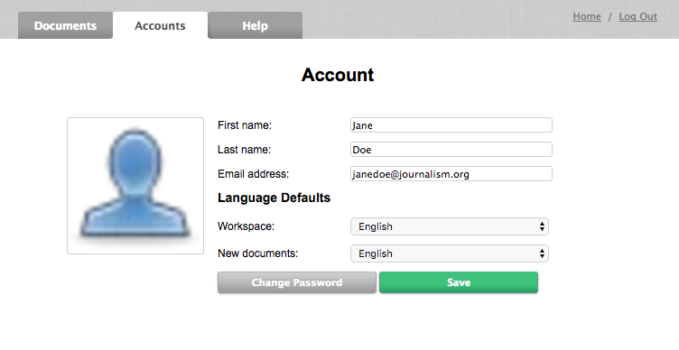
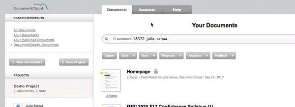
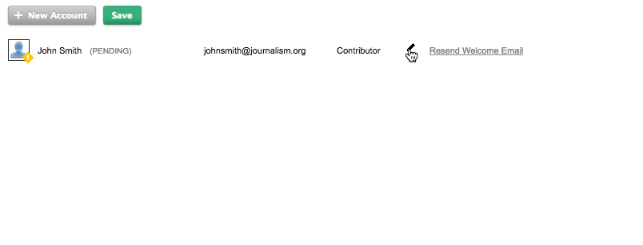

# Managing Accounts
DocumentCloud makes it easy to manage your account settings and, if you have an administrator-level account, manage other accounts and settings in your organization.

**In this article:**
* Change language settings
* Change your name and email
* Learn about different account types
* Add a new user account to your organization
* Disable a user account

## Personal Information and Language Settings
Manage your DocumentCloud account and settings by clicking the **"Accounts"** tab at the top of the workspace:

The settings you can edit include: 

* **Your name, the email address you use to log in, and your password.** If you have an account with [Gravatar](https://en.gravatar.com), your avatar will appear in the workspace.

* **Your language defaults.** Under Workspace, you can choose a default for menu and form languages. Under New Documents, you can choose the default OCR language for new documents.

Click **"Save"** to store any changes.

## Types of Accounts

DocumentCloud supports three categories of users in any organization: **administrators**, **contributors**, and **freelancers**.
* ####  Administrators
Administrators can create new DocumentCloud accounts and disable old ones. Assign administrative privileges to as many users as appropriate.
* #### Contributors
Contributors can upload, annotate and edit documents, and they can access documents shared across the organization.
* #### Freelancers
Freelancers can upload, annotate, and edit their own documents and any documents that have been explicitly shared with them. Freelancers do not have access to the rest of your organization's documents.

You may also wish to learn more about [reviewers and other collaboration tools](collaboration.md) or read up on [DocumentCloud privacy](privacy.md).

## Adding New Accounts
If you are an administrator of your organization's DocumentCloud account, you can easily add others from your organization to DocumentCloud.

#### To Add an Account:

1. Select the **“Accounts”** tab. You should see your personal account information and workspace options.
2. Click on the name of your organization in the left-hand sidebar.
    
3. Select **“New Account”**.
4. Input the first name, last name, and email address of the person you would like to add to DocumentCloud.
    
5. Using the dropdown, designate them as a **contributor**, **administrator**, or **freelancer**.
6. Select **“Ok”**. 
7. Select **“Save”**. A welcome email will be sent to that person’s email address letting them know how to log in and get started.

## Disabling Accounts

DocumentCloud accounts cannot be deleted, but they can be disabled. Administrators will typically do this when a person has left their organization. **It's a good idea to review your organization's user accounts from time to time to make sure their statuses are appropriate.**

#### To Disable an Account:

1. Click the **pencil icon** next to the account.
2. Click the **"Disable"** button.
    

Should the need arise, an account can be re-enabled later on. Simply go through the same process as outlined above and select **"Re-Enable"**.

NOTE: When an account is disabled, all the documents that person uploaded to DocumentCloud remain hosted on the organization's account. Their annotations will remain as well. If you want to permenantly purge the contents of user's account, please contact DocumentCloud support at **support@documentcloud.org**.

## Switching organizations

If you are switching the organization you work for but would like to retain access to the DocumentCloud account you've been using, please contact us at **support@documentcloud.org**.

