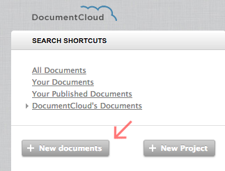
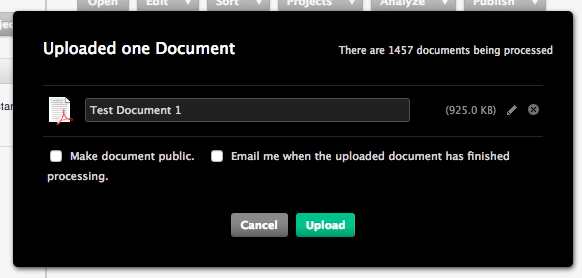
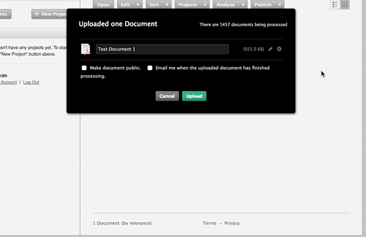
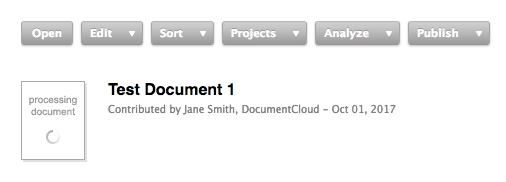
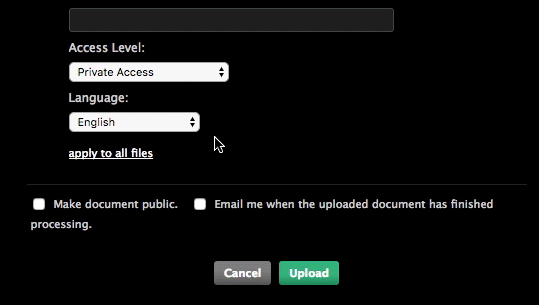

# Uploading Documents

#### In this article:

* [Upload via the workspace](#upload-via-the-workspace)
* [Upload via the API](#upload-via-the-api)
* [Compatible file formats](#compatible-file-formats)
* [Compatible file size](#compatible-file-size)

***

As a DocumentCloud user, you'll want to build a collection of files to research, analyze, annotate and publish with our embeds. Fortunately, uploading files—whether you have a handful or several thousand—is easy.

## Upload via the Workspace
There are two ways to upload in the workspace:

* Drag and drop the documents onto the workspace itself. 

* Alternately, click the **"New Documents"** button in the sidebar and select the files you'd like to upload. 
    
    

To select more than one document, hold down the ctrl key in Windows or the command key in OSX.

<b>NOTE:</b> Multiple document upload is not supported in older versions of Internet Explorer.

1. **The uploader will suggest a title for your document based on its file name.** You can edit the title before you continue, or you can edit the title plus other metadata after the document is uploaded. 

    

2. Click the **pencil icon** to add a description and source for each document and set the **access level**. (default is private).      
    
    
    • **Public Access** - Anyone, even those without DocumentCloud accounts, may access the document.   
    • **Private Access** - The default. Only you can access the document.   
    • **Private to DocumentCloud** - Only people in your organization may access the document.  

3. If the files you are uploading should share a source and description, click **"Apply to All Files."**
4. When you're ready, click **"Upload".** The dialog will close when all files have been uploaded.

    
5. Before you can work with your documents, **DocumentCloud must process the documents for the document viewer.** The amount of time required to process a document varies based on its size, its type, and the current amount of platform activity.

To view all the documents you've uploaded, click on the **"Your Documents"** link at the top left.

<b>NOTE:</b> If you're uploading a very large file, it might be a good idea to check the "email me when the uploaded document has finished processing" box. <b>If you plan to upload many large documents at once, let us know so we can ensure there's enough computing resources available.</b>

<b>NOTE:</b> Running into trouble uploading documents? Check out our <a href="troubleshooting.html">troubleshooting page</a>.

## Upload via the API
**Users who want to upload many hundreds or thousands of documents or automate document uploads may want to consider using the [DocumentCloud API](api.html).** The `upload.json` method provides for passing in file name, project id and numerous other parameters with the file itself. It also allows for uploads directly from a URL.

**If your file has text embedded, DocumentCloud extracts and saves it.** If not (as with an image file or a PDF of a scanned document), DocumentCloud uses optical character recognition [(OCR)](https://en.wikipedia.org/wiki/Optical_character_recognition) software to attempt to identify the text. For this, our platform relies upon the open-source [Tesseract library](https://github.com/tesseract-ocr/tesseract).

**Through Tesseract, DocumentCloud currently supports more than 20 languages for OCR, including Arabic, Spanish and Russian.** You can select a default language under the "Accounts" tab in the workspace. Choose a language under the "New Documents" drop-down menu.

## Compatible File Formats
Most DocumentCloud users work with **PDFs**, but our software can take any file type that LibreOffice supports.

**This includes:**
* Microsoft Word
* Excel
* PowerPoint
* Rich Text Files
* Various image files including TIFF, PNG, GIF and JPEG.

Upon upload, all non-PDF files are converted to PDF for use in DocumentCloud.
## Compatible File Size
**The maximum file size for an upload to DocumentCloud is 400 MB.** However, files that large are difficult to process, and you will likely get better results if you optimize large documents (anything over 10 MB) before you upload them. **You can find instructions on how to to optimize PDFs [here](troubleshooting.html#optimizing-pdfs).**
